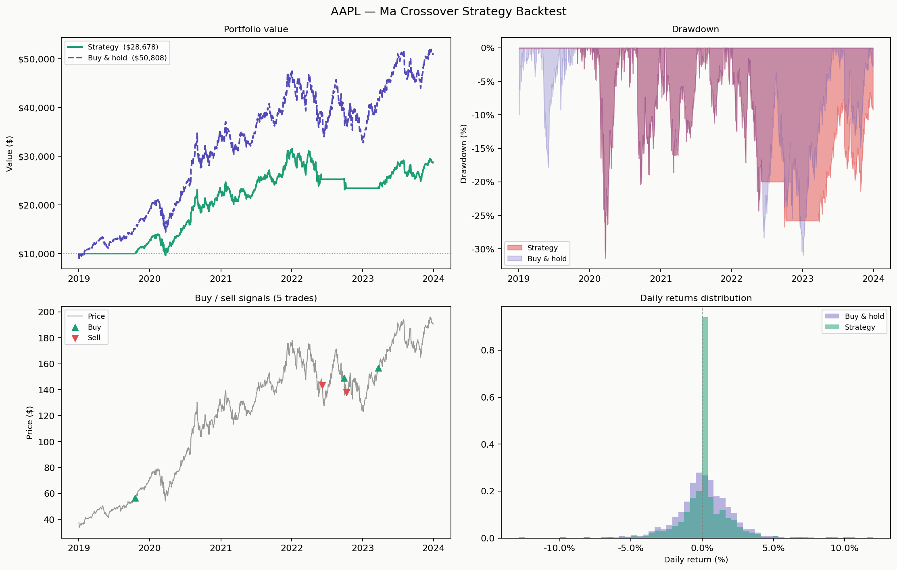

# Backtesting Engine

Tests trading strategies against real historical price data and measures their performance against a buy-and-hold benchmark.



## Strategies

- **MA Crossover** — buys when the 50-day moving average crosses above the 200-day (golden cross), sells on the reverse
- **Mean Reversion** — buys when price drops more than 1.5 standard deviations below its 20-day mean, exits when it recovers
- **Momentum** — buys when the stock's 90-day return is positive, stays in cash otherwise

## Metrics reported

Total return, annualised return, Sharpe ratio, max drawdown, win rate, number of trades, transaction costs.

## Run it

```bash
pip install numpy pandas matplotlib yfinance
python backtesting_engine.py
```

```bash
# Compare all strategies at once
python backtesting_engine.py --all-strategies

# Different stock and strategy
python backtesting_engine.py --ticker NVDA --strategy momentum --start 2020-01-01
```

## Stack
Python · NumPy · pandas · Matplotlib · yfinance
